# 📚 Digital Library Management System

<div align="center">


### A Full Stack Digital Library Management System built using Spring Boot, React.js & MongoDB

</div>

---

# 📖 Overview

The **Digital Library Management System** is a full-stack web application that enables users to browse digital books, read articles, explore story books, borrow library resources, participate in question discussions, and stay updated with the latest news.

The application also provides an **Admin Dashboard** for managing books, users, articles, news, borrow records, and library content.

---

# ✨ Features

## 👤 User Features

- 🔐 Secure Login & Registration
- 📚 Browse Digital Books
- 🔍 Search Books
- 📖 Read Books Online
- 📰 Read Articles
- 📘 Read Story Books
- 📰 View Latest News
- ❓ Question & Answer Forum
- 📥 Borrow Books
- 📥 Borrow Articles
- 📥 Borrow Story Books
- 📅 Due Date Tracking
- 💰 Late Fine Notification (₹50/day)
- 👤 User Dashboard
- 📜 Borrow History

---

## 👨‍💼 Admin Features

- 📊 Admin Dashboard
- 📚 Manage Books
- 👥 Manage Users
- 📰 Manage News
- 📝 Manage Articles
- 📖 Manage Borrow Records
- ❓ Manage Questions
- ✏️ Update Records
- ❌ Delete Records

---

# 🛠 Tech Stack

| Technology | Description |
|------------|-------------|
| Java 17 | Backend Language |
| Spring Boot | Backend Framework |
| Spring Security | Authentication & Authorization |
| JWT | Token Based Authentication |
| MongoDB | NoSQL Database |
| React.js | Frontend Framework |
| React Router | Routing |
| Axios | REST API Calls |
| Bootstrap 5 | Responsive UI |
| CSS3 | Custom Styling |
| Maven | Dependency Management |

---

# 🏗 System Architecture

```
                React Frontend
                      │
                Axios REST API
                      │
            Spring Boot Backend
                      │
       Spring Security + JWT
                      │
              MongoDB Database
```

---

# 📂 Project Structure

```
Management_System
│
├── backend
│   ├── controller
│   ├── service
│   ├── repository
│   ├── model
│   ├── security
│   └── config
│
├── frontend
│   ├── components
│   ├── pages
│   ├── services
│   ├── styles
│   └── assets
│
└── screenshots
```

---

# 📷 Application Screenshots

## 🏠 Home Page

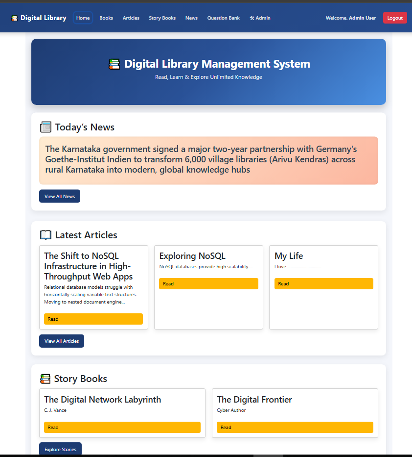

---

## 📚 Book Details

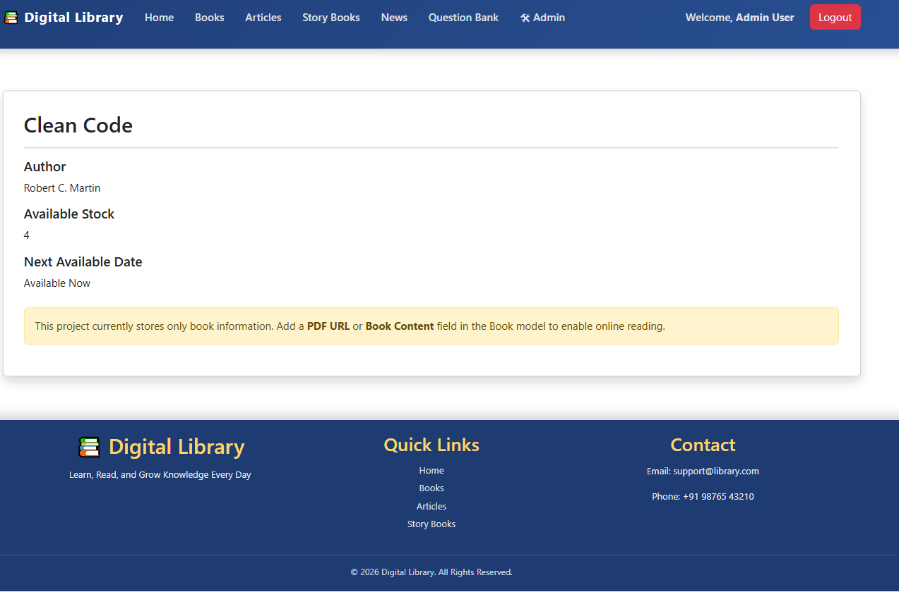

---

## 📰 Articles

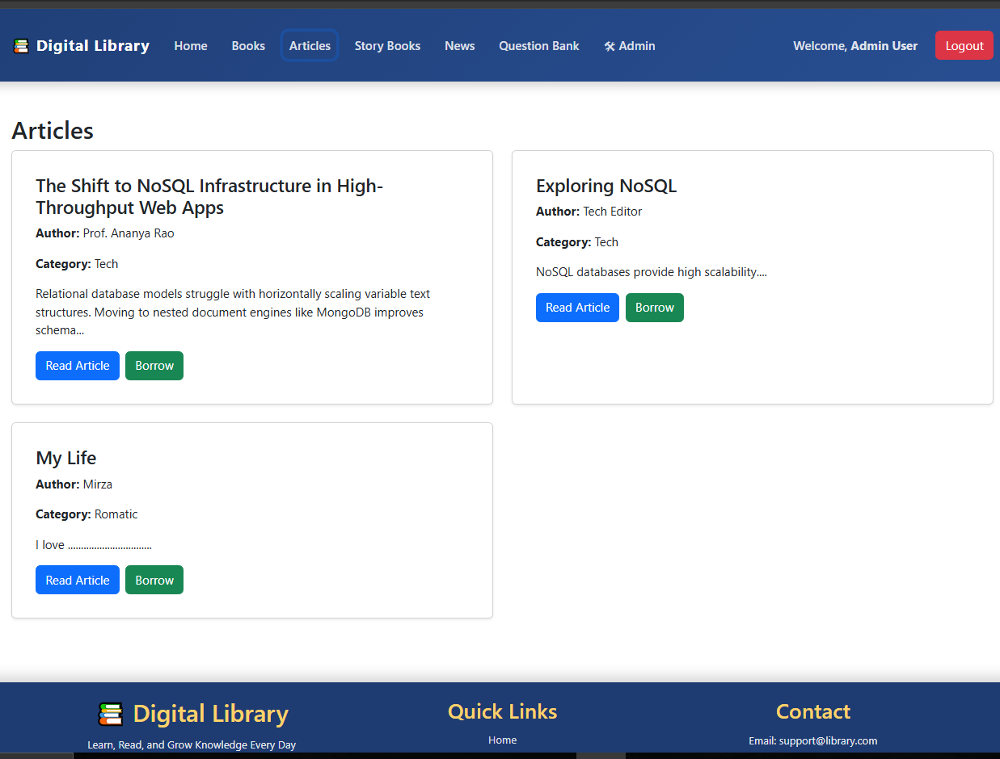

---

## 📖 Story Books

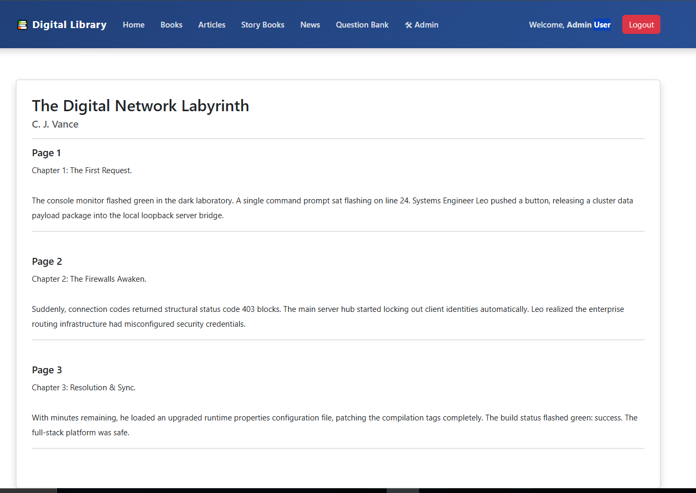

---

## 📰 News

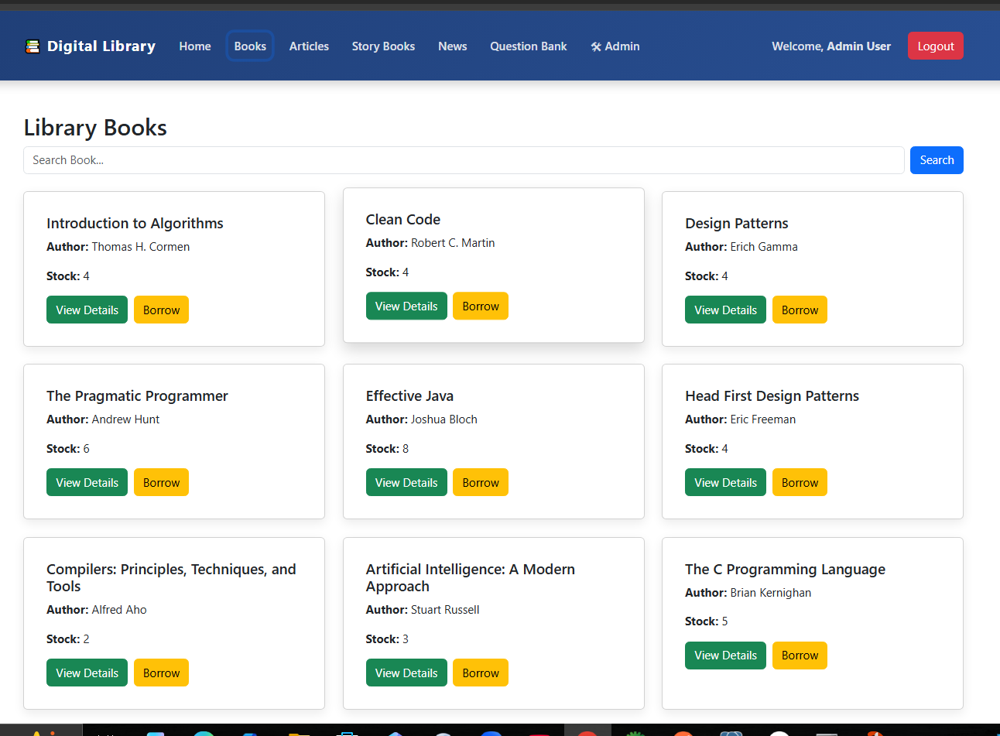

---

## ❓ Question Bank

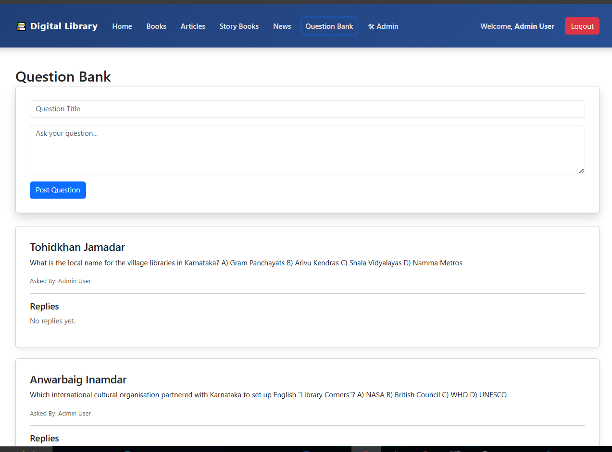

---

## 👤 User Dashboard

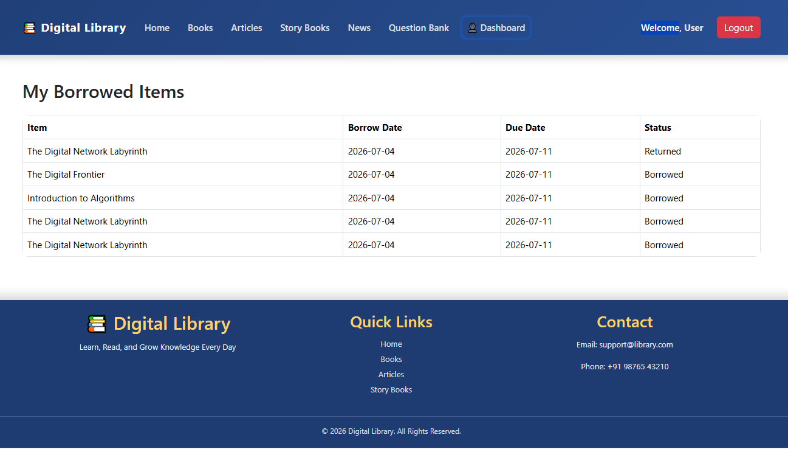

---

## 👨‍💼 Admin Dashboard

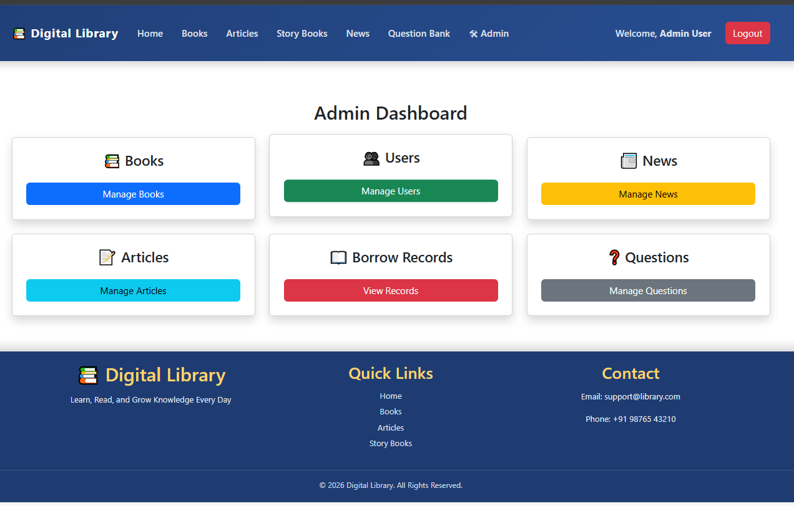

---

## 📚 Manage Books

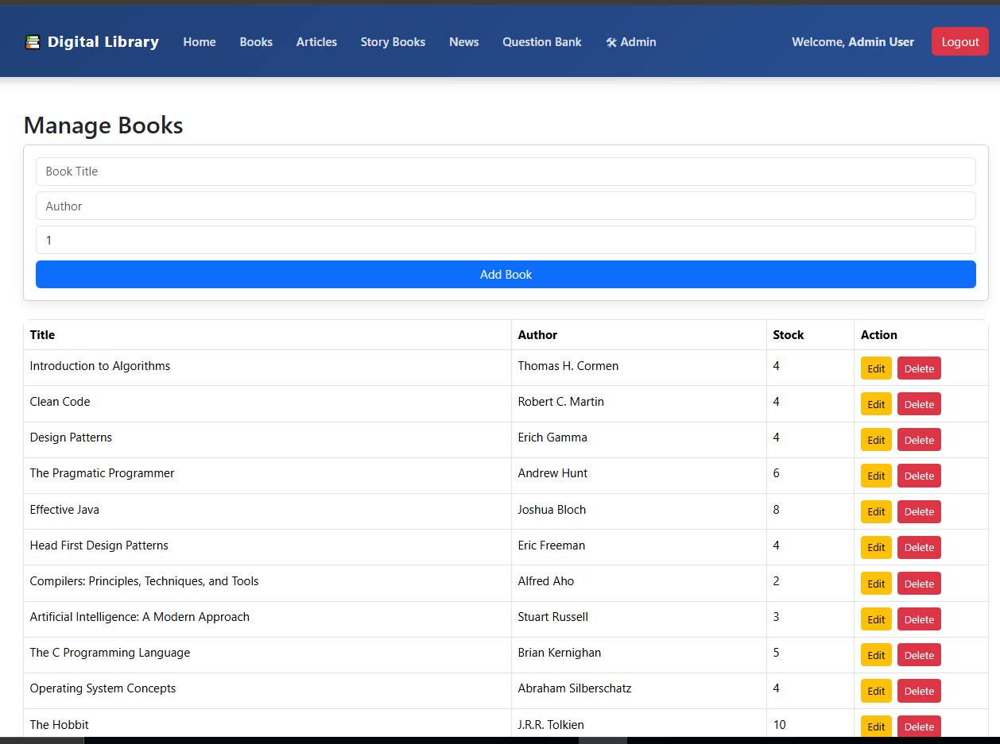

---

## 👥 Manage Users

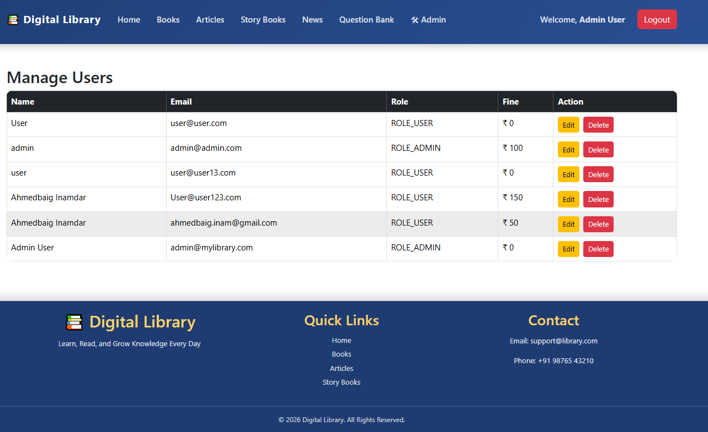

---

## 📰 Manage News


---

## 📝 Manage Articles

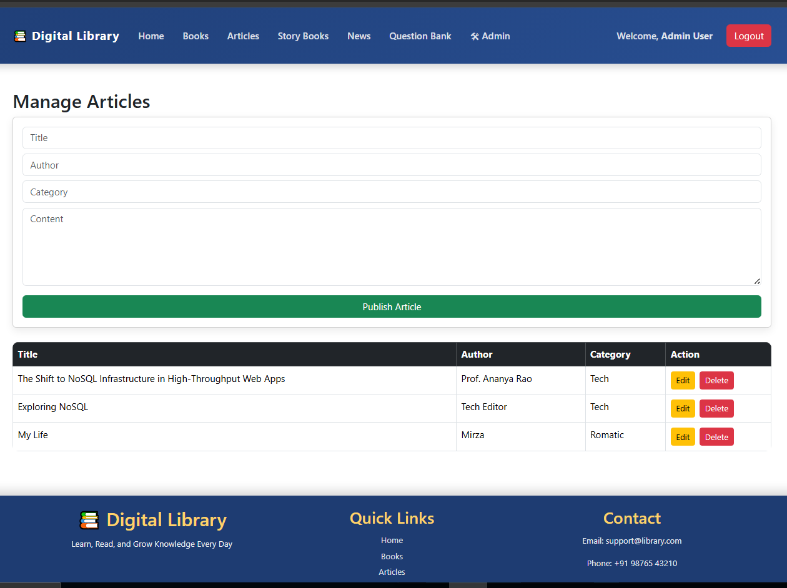

---

## 📖 Borrow Records

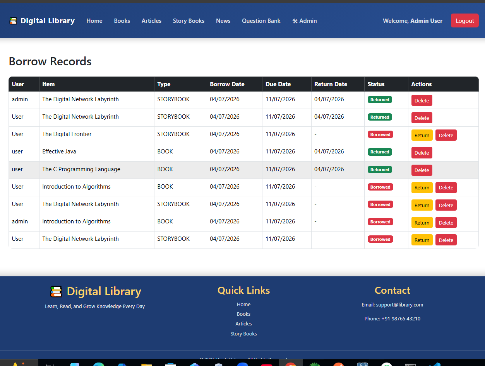

---

# 🔐 Authentication

- JWT Authentication
- Role Based Authorization
- ROLE_ADMIN
- ROLE_USER

---

# 📡 REST API

## Authentication

```
POST /api/auth/register
POST /api/auth/login
```

---

## Books

```
GET    /api/books
GET    /api/books/search
POST   /api/user/borrow/book
```

---

## Articles

```
GET    /api/features/articles
POST   /api/user/borrow/article
```

---

## Story Books

```
GET    /api/features/storybooks
POST   /api/user/borrow/storybook
```

---

## News

```
GET /api/features/news
```

---

## Questions

```
GET    /api/questions
POST   /api/questions
POST   /api/questions/{id}/reply
```

---

## Borrow

```
GET    /api/user/borrowed-items
POST   /api/user/return/{borrowId}
```

---

## Admin

```
GET     /api/admin/books
POST    /api/admin/books
PUT     /api/admin/books/{id}
DELETE  /api/admin/books/{id}

GET     /api/admin/users
PUT     /api/admin/users/{id}
DELETE  /api/admin/users/{id}

GET     /api/admin/articles
POST    /api/admin/articles
PUT     /api/admin/articles/{id}
DELETE  /api/admin/articles/{id}

GET     /api/admin/news
POST    /api/admin/news
PUT     /api/admin/news/{id}
DELETE  /api/admin/news/{id}

GET     /api/admin/borrow-records
DELETE  /api/admin/borrow-records/{id}
```

---

# ⚙️ Installation

## Clone Repository

```bash
git clone https://github.com/ahmedbaiginam-stack/Management_System.git
```

---

## Backend

```bash
cd backend

mvn clean install

mvn spring-boot:run
```

Runs on:

```
http://localhost:8080
```

---

## Frontend

```bash
cd frontend

npm install

npm run dev
```

Runs on:

```
http://localhost:5173
```

---

# 🚀 Future Improvements

- 📱 Mobile Responsive UI Enhancements
- 📧 Email Notifications
- 💳 Online Fine Payment
- ⭐ Ratings & Reviews
- 📚 Book Reservation
- 📈 Admin Analytics Dashboard
- 🌙 Dark Mode
- 🔔 Push Notifications

---

# 👨‍💻 Developer

**Ahmedbaig Inamdar**

GitHub

https://github.com/ahmedbaiginam-stack

Repository

https://github.com/ahmedbaiginam-stack/Management_System

---

# 📄 License

This project is developed for educational and learning purposes.

---

<div align="center">

### ⭐ If you found this project useful, please consider giving it a Star on GitHub!

Made with ❤️ using Spring Boot, React & MongoDB

</div>
